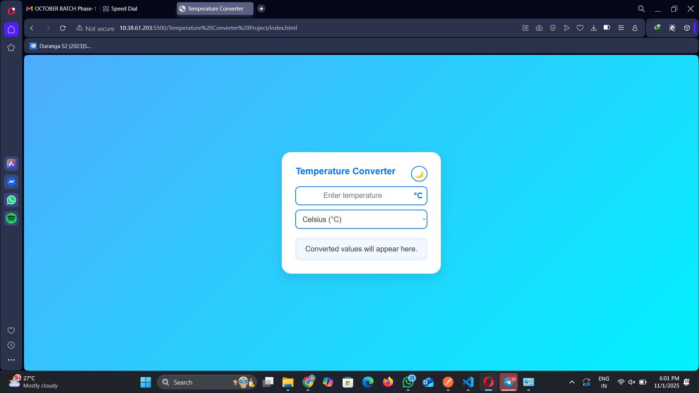
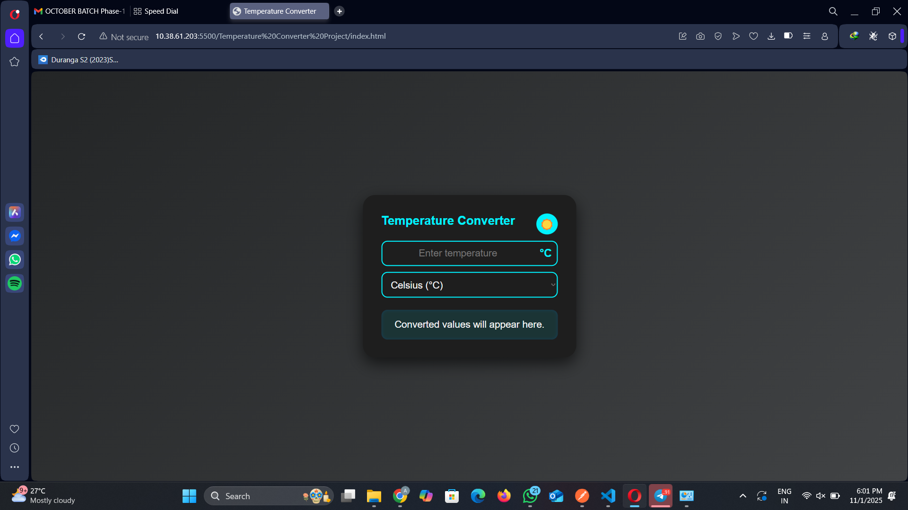

# Temperature Converter 

This project is a small temperature converter with the CSS and JavaScript extracted into modular files.

##💡Recommended Structure
```
temperature-converter/
│
├── index.html
├── style.css
├── script.js
├── README.md
└── images/
    ├── light-mode.png
    └── dark-mode.png
```
## ▶️ How to run
1. Open `index.html` in your browser (double-click or drag into a browser window).
2. Enter a temperature and choose the unit. Results update live. Click the clipboard icon to copy a value.

## 🖥️ Preview
<p align="center">
  
  
</p>

## 🚀 Features
- Instant conversion between Celsius, Fahrenheit, and Kelvin  
- Copy-to-clipboard feature  
- Dark / Light mode toggle  
- Responsive design for all devices  
